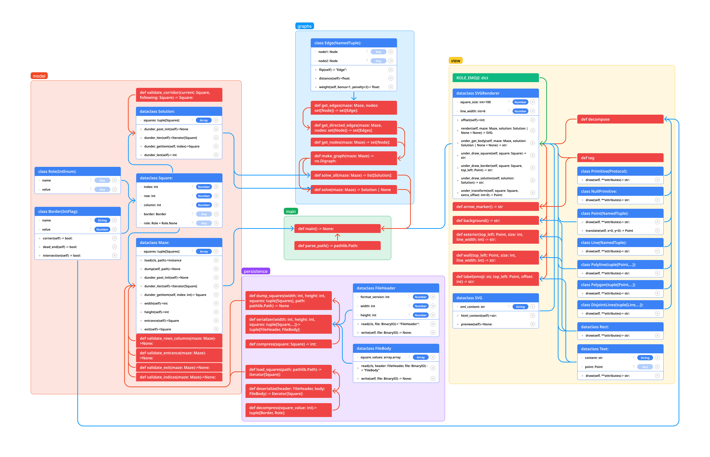

# a-maze-ing: 

## README Contents:
1. Description
1. Authors
1. Installation
1. Requirements
1. Tests
1. Usage
1. File Structure
1. Domain Model

## External README Contents

1. [Team Agreement](team_agreement.md)
1. [Project Ideas](project_ideas.md)
1. [Project Design](project_design.md)
1. [Requirements](requirements.md)

## Description:

This is a command-line interface to create and solve mazes. A client will be able to generate new mazes and save them as binary files. The client will also be able to generate a solution for a maze and save its image.

## Authors:
[KP Gomez](https://github.com/kpgomez)

[Jacob Bassett](https://github.com/jdabassett)

## Installation:

Run the following command in the terminal to clone this repository to your local environment.
```bash
git clone https://github.com/amazing-maze-solver/a-maze-ing.git
cd a-maze-ing
python3 -m venv .venv
# source .venv/bin/activate for macOS
# .venv\Scripts\activate for windows
```

## Requirements:

Run the following command in the terminal to install all requirements.

```bash
pip install -r requirements.txt
```
These are the required software you will be installing into your virtual environment.
 * cairocffi==1.6.1
 * CairoSVG==2.7.1
 * cffi==1.16.0
 * coverage==7.3.2
 * cssselect2==0.7.0
 * Cython==0.29.32
 * defusedxml==0.7.1
 * exceptiongroup==1.2.0
 * iniconfig==2.0.0
 * markdown-it-py==3.0.0
 * mazelib==0.9.14
 * mdurl==0.1.2
 * networkx==3.2.1
 * numpy==1.23.4
 * packaging==23.2
 * Pillow==10.1.0
 * pluggy==1.3.0
 * pycparser==2.21
 * Pygments==2.17.2
 * pytest==7.4.3
 * pytest-cov==4.1.0
 * rich==13.7.0
 * tinycss2==1.2.1
 * webencodings==0.5.1

## Tests:

Run the following command in the terminal to run all tests.
```bash
pytest --cov
```
## Usage:

Run the following command in the terminal to start the application.
```bash
python3 -m scripts.main
```

## File Structure:

```bash
.
├── README.md
├── requirements.txt
├── scripts
│   ├── __init__.py
│   ├── location_classes.py
│   ├── location_functions.py
│   └── main.py
├── src
│   ├── generate
│   │   ├── __init__.py
│   │   ├── convert_api_maze.py
│   │   └── create_maze.py
│   ├── graphs
│   │   ├── __init__.py
│   │   └── solver.py
│   ├── models
│   │   ├── __init__.py
│   │   ├── border.py
│   │   ├── maze.py
│   │   ├── role.py
│   │   ├── solution.py
│   │   └── square.py
│   ├── persistence
│   │   ├── __init__.py
│   │   ├── file_format.py
│   │   └── serializer.py
│   ├── solve
│   │   ├── __init__.py
│   │   └── solver.py
│   └── view
│       ├── __init__.py
│       ├── decomposer.py
│       ├── primitives.py
│       └── renderer.py
└── tests
    ├── __init__.py
    ├── test_generate.py
    ├── test_menu.py
    ├── test_models.py
    ├── test_persistence.py
    ├── test_solve.py
    └── test_view.py
```

## Domain Model:

This is the basic domain model from the tutorial. 
We will be recreating a version of this and adding new features like generating new mazes and converting the solution into a movie.

