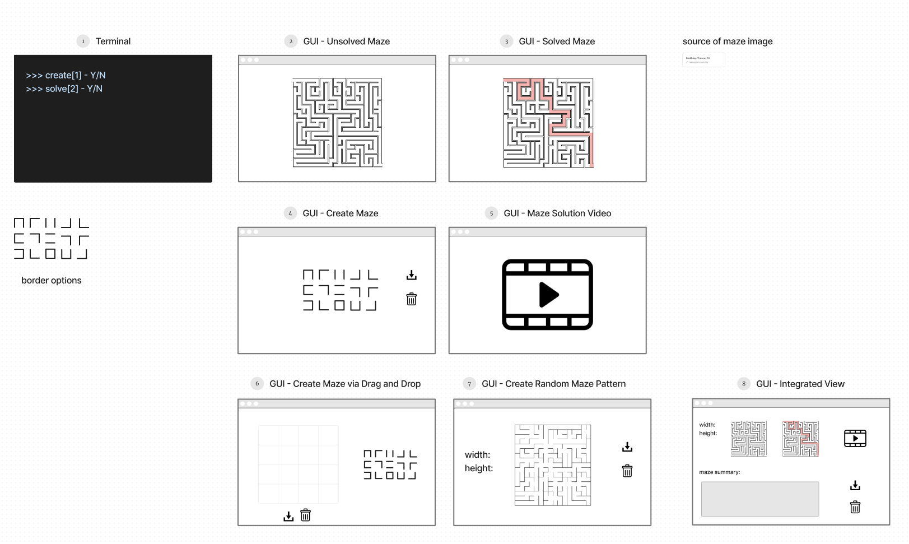

# 'a-maze-ing' Project Design

## Wireframes:

## User Stories:
1. Title: 
    * User Story: As a user, I want to have a solution to this maze, so that I can solve it.
    * Feature Tasks: 
      * User selects to solve maze
      * User selects maze
      * User sees unsolved maze
      * User confirms before solution is found
    * Acceptance Tests: 
      * Validate that upload file is working 
      * Validate maze is proper file type
      * Validate maze is proper format
      * Validate transform to graph is working
      * Validate networkx is working
1. Title: 
    * User Story: As a user, I want to be able to see the solution, so that I can better understand it.
    * Feature Tasks: 
      * ...
      * User sees solution if it exists
      * User chooses whether to save files
      * User provides file names
    * Acceptance Tests: 
      *  ...
      * Validate that maze to image is working
      * Validate that save image is working
      * Validate that save binary maze file is working
      * Validate that gui is functional
1. Title: 
    * User Story: As a user, I want to understand the algorithm that created the solution, so I can make observations about it's efficiency/implementation/downsides.
    * Feature Tasks:
      * ...
      * User selects solving algorithm
    * Acceptance Tests:
      * ...
      * Validate that networkx can solve test maze with several different algorithms
1. Title: 
    * User Story: As a user, I want to be able to generate a new maze, so that I can test different maze solver algorithms.
    * Feature Tasks:
      * ...
      * User selects that they want to create a new maze
      * User input maze dimensions
      * User sees new maze
      * User chooses whether to save maze
      * User provides file name
    * Acceptance Tests:
      * ...
      * Validate that maze creation works
      * Validate that user input is valid maze dimensions or file name
1. Title: 
    * User Story: As a user, I want to see a video of the solution being made, so that I can better understand the algorithm.
    * Feature Tasks:
      * ...
      * User sees solution movie
      * User chooses whether to save maze
      * User provides file name
    * Acceptance Tests:
      * ...
      * Validate movie creation
      * Validate movie can be saved
      * Validate that user input is valid file name
